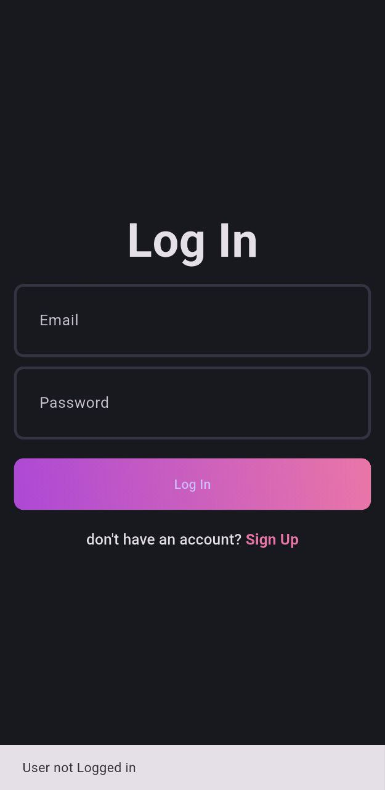
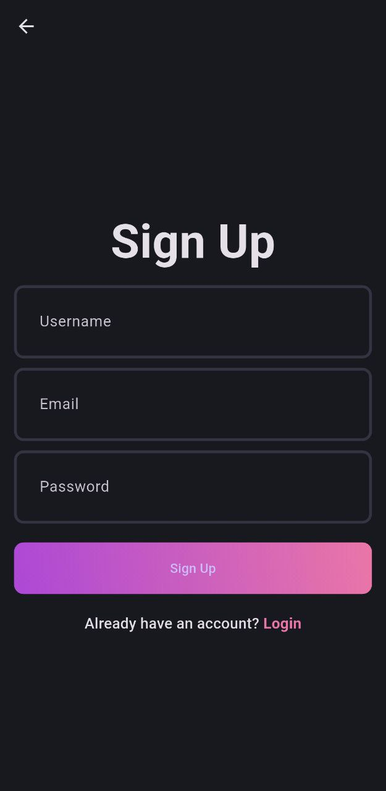
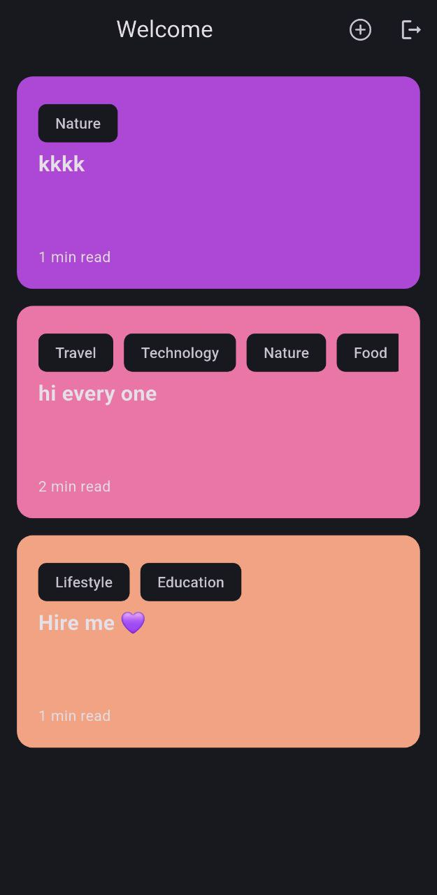
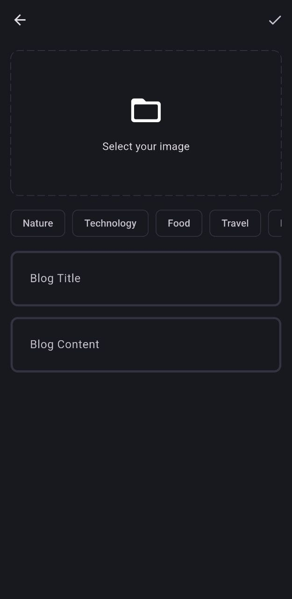

# 📖 Blog Application

A Flutter-powered blog application with Supabase as the backend, allowing users to create and read log posts effortlessly. This project demonstrates authentication, real-time data handling, and a clean UI/UX design.

## ✨ Features

🔐 User Authentication – Sign up, log in, and log out with Supabase Auth.

📝 Create Blogs – Users can write blog posts.

🔄 Real-time Database – Blog posts are stored in a Supabase PostgreSQL database.

🎨 Responsive UI – Works seamlessly on Android, iOS, and Web.

🎭 State Management – Uses Bloc & Cubit for efficient state handling.

🗂 Image Uploads – Supports adding images to blog posts.

## 🛠 Tech Stack

Flutter (Dart) – Frontend framework

Supabase – Backend & Database

Bloc – State management

Supabase Storage – For image uploads

## 📌 Prerequisites

Ensure you have the following installed:

Flutter SDK

Dart

Supabase Account

## 📷 Screenshots

## 🎮 Usage

Register/Login to access the blog platform.

Create a new blog post with a title, content, and image.
